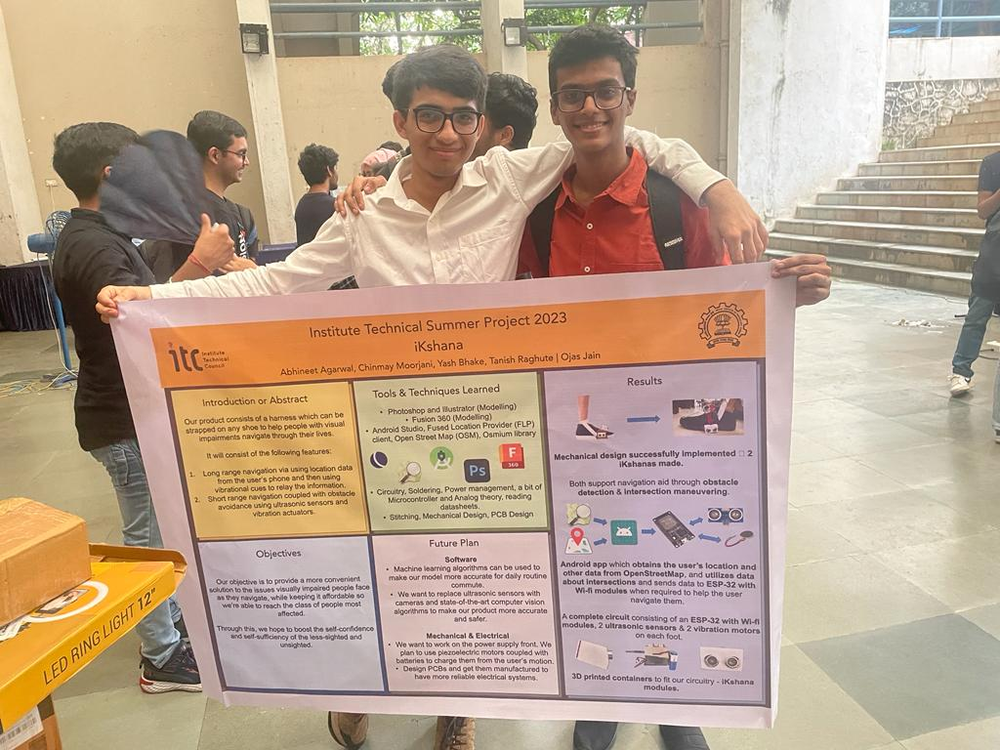
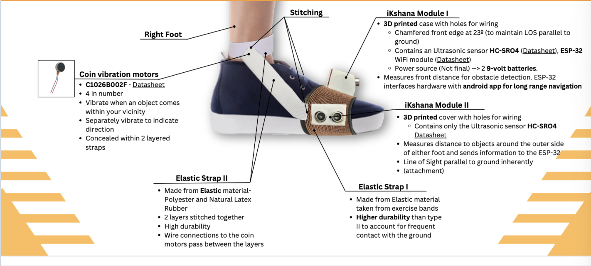
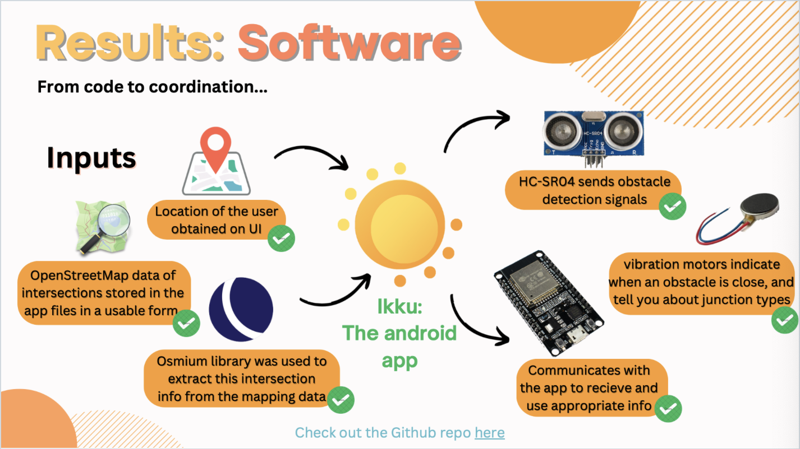
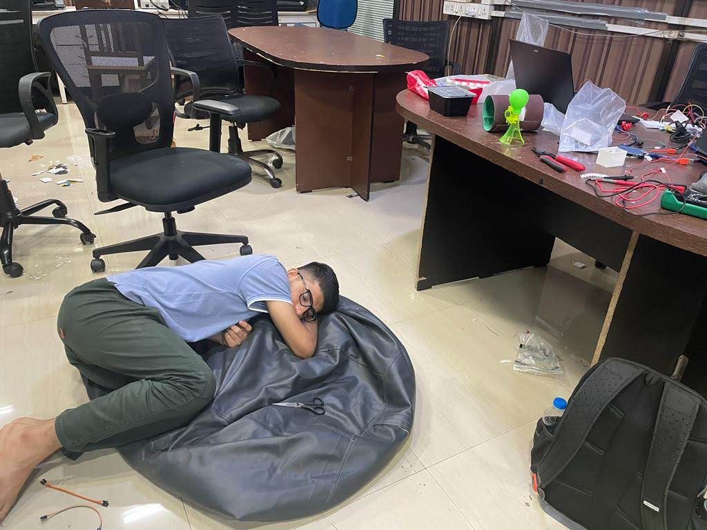
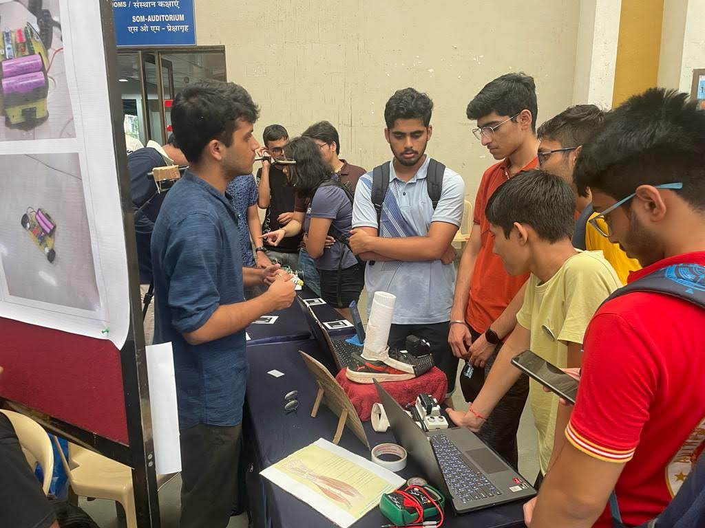

# iKshana - Navigation System for the Visually Impaired

A wearable foot harness providing both short-range obstacle detection and long-range GPS navigation for visually impaired individuals.

<p align="center">
  
</p>
<p align="center"><em>Team iKshana presenting at the Institute Technical Summer Project (ITSP) 2023 finale</em></p>

## 🏆 Achievement

**2nd Place** among 100+ teams at the Institute Technical Summer Project (ITSP) 2023, IIT Bombay

## 👥 Team Members

- **Abhineet Agarwal** (Team Lead)
- **Chinmay Moorjani**
- **Yash Bhake**
- **Tanish Raghute**
- **Ojas Jain**

## 📋 Project Overview

iKshana (Sanskrit for "vision") is a comprehensive navigation solution designed to enhance mobility and independence for visually impaired individuals. The system consists of wearable foot harnesses that provide:

1. **Short-Range Navigation**: Ultrasonic sensors detect obstacles within 30cm, triggering vibration motors to alert the user
2. **Long-Range Navigation**: GPS-based turn-by-turn guidance using haptic feedback patterns

<p align="center">
  
</p>
<p align="center"><em>iKshana module design showing ultrasonic sensors, vibration motors, and ESP32 integration</em></p>

## 🎯 Features

### Hardware
- **Dual foot modules** - One module per foot for directional feedback
- **Ultrasonic sensors (HC-SR04)** - Obstacle detection up to 30cm range
- **Coin vibration motors** - Haptic feedback for alerts and navigation cues
- **ESP32 microcontroller** - WiFi-enabled for smartphone communication
- **3D printed enclosures** - Lightweight, comfortable harness design
- **Elastic straps** - Universal fit for any shoe type

### Software
- **Android companion app** - GPS tracking and route planning
- **OpenStreetMap integration** - Offline-capable intersection database
- **Osmium library** - Efficient map data processing
- **UDP communication** - Real-time data exchange between app and harness

<p align="center">
  
</p>
<p align="center"><em>Software architecture showing data flow from sensors and GPS to haptic feedback</em></p>

## 🔧 Hardware Requirements

| Component | Quantity | Purpose |
|-----------|----------|---------|
| ESP32 Development Board | 2 | Main controller (one per foot) |
| HC-SR04 Ultrasonic Sensor | 4 | Obstacle detection (2 per foot) |
| Coin Vibration Motor | 4 | Haptic feedback (2 per foot) |
| 18650 Li-ion Battery | 2 | Power supply |
| 3D Printed Enclosure | 2 | Housing for electronics |
| Elastic Straps | 4 | Attachment to footwear |

## 📁 Repository Structure

```
ikshana/
├── src/
│   ├── esp32/
│   │   ├── main.ino           # Main ESP32 code with WiFi and sensors
│   │   ├── receiver.ino       # UDP receiver module
│   │   └── ultrasonic_basic.ino # Basic ultrasonic test code
│   └── android/
│       └── GPSLocationTracking/ # Android Studio project
├── docs/
│   ├── Presentation.pdf       # Final presentation slides
│   ├── final_documentation.docx
│   ├── Abstract.docx
│   ├── intersections_data.json # Pre-processed intersection data
│   ├── map.osm               # OpenStreetMap data for IIT Bombay
│   └── nodes_data.txt        # Navigation nodes
├── images/                    # Project photos
└── README.md
```

## 🚀 Getting Started

### ESP32 Setup

1. Install Arduino IDE with ESP32 board support
2. Install required libraries:
   - WiFi (built-in)
   - WiFiUdp (built-in)
3. Open `src/esp32/main.ino`
4. Update WiFi credentials:
   ```cpp
   const char *ssid = "YourWiFiSSID";
   const char *password = "YourWiFiPassword";
   ```
5. Upload to ESP32

### Android App Setup

1. Open `src/android/GPSLocationTracking` in Android Studio
2. Sync Gradle dependencies
3. Update the ESP32 IP address in `MainActivity.java`
4. Build and install on Android device (API 21+)

### Wiring Diagram

**ESP32 Pin Connections:**
| Component | ESP32 Pin |
|-----------|-----------|
| Ultrasonic 1 Trigger | GPIO 5 |
| Ultrasonic 1 Echo | GPIO 18 |
| Ultrasonic 2 Trigger | GPIO 27 |
| Ultrasonic 2 Echo | GPIO 26 |
| Vibration Motor 1 | GPIO 23 |
| Vibration Motor 2 | GPIO 22 |

## 📖 How It Works

### Short-Range Navigation
1. Ultrasonic sensors continuously measure distance to obstacles
2. When an obstacle is detected within 30cm, the corresponding vibration motor activates
3. Different patterns indicate obstacle direction (left/right foot, front/side)

### Long-Range Navigation
1. User sets destination in the Android app
2. App calculates route using OpenStreetMap data
3. At each intersection, the app sends navigation commands via UDP
4. Vibration patterns guide the user:
   - **Left foot vibrates**: Turn left
   - **Right foot vibrates**: Turn right
   - **Both feet vibrate**: Continue straight / destination reached

## 🛠️ Development Journey

<p align="center">
  
  
</p>
<p align="center"><em>Left: Late-night prototyping sessions. Right: Demonstrating iKshana at the ITSP exhibition.</em></p>

This project was developed over the summer of 2023 as part of IIT Bombay's Institute Technical Summer Project program. Key milestones:

- **May 2023**: Ideation and initial prototyping
- **June 2023**: Hardware assembly and basic obstacle detection
- **July 2023**: Android app development and GPS integration
- **August 2023**: Final integration, testing, and presentation

## 📚 Documentation

- [Final Presentation](docs/Presentation.pdf)
- [Project Documentation](docs/final_documentation.docx)
- [Abstract](docs/Abstract.docx)

## 🔮 Future Improvements

1. **Computer Vision**: Replace ultrasonic sensors with camera-based obstacle detection
2. **Machine Learning**: Predictive navigation based on user patterns
3. **Piezoelectric Charging**: Harvest energy from walking motion
4. **Custom PCB**: Reduce size and improve reliability
5. **Voice Feedback**: Audio cues for complex navigation scenarios

## 🙏 Acknowledgments

- Institute Technical Council, IIT Bombay for organizing ITSP 2023
- Tinkerer's Lab, IIT Bombay for providing workspace and equipment
- All mentors and judges who provided valuable feedback

---

**Note**: This was our first hardware project in college and the beginning of lasting friendships forged through late-night debugging sessions and the shared joy of seeing our creation help people navigate the world.
